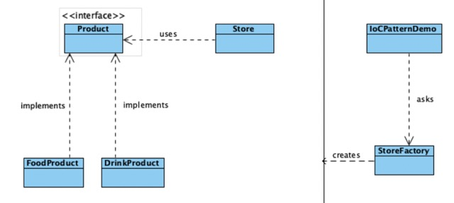
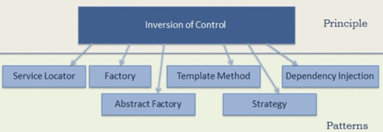
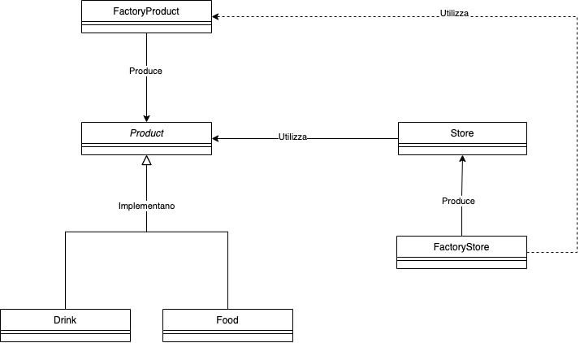

## descrizione:
usato per ==gestire in modo flessibile le dipendenze== delle classi utilizzando delle ==interfacce==.

Si fa in modo da ==non== creare ==dipendenze da livello alto al basso== (solo interfacce)

## patterns:

## esempio:
