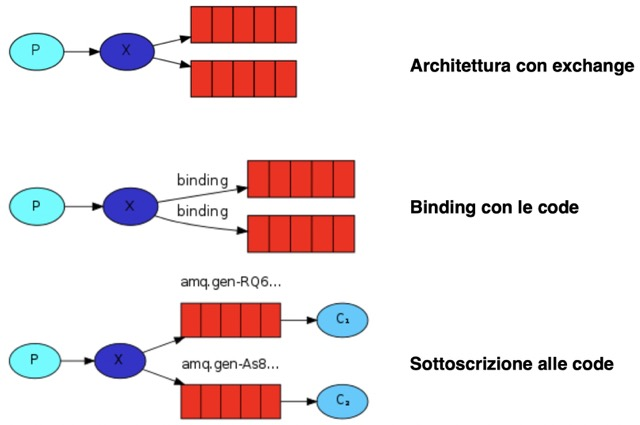

## descrizione:
permette l'utilizzo di un ==exchange (**X**)== che ==gestisce i messaggi==, aspettando la ==subscription del consumer(**C**)== con la quale potrà ==decidere quali messaggi farsi arrivare==


## run:
1. start di rabbitmq:
```
brew services start rabbitmq
```
2. run della classe:
```
$ cd project_path
$ java -cp .:path library:path library:path library src/folder/class.java
```