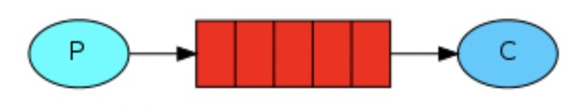

## descrizione:
permette di inviare messaggi in ==broadcast== tra ==producer (**P**)== e ==consumer (**C**)== tramite una ==singola coda==


## run:
1. start di rabbitmq:
```
brew services start rabbitmq
```
2. run della classe:
```
$ cd project_path
$ java -cp .:path library:path library:path library src/folder/class.java
```